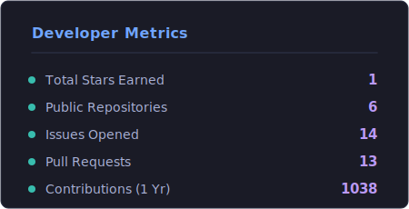

# Hi, I'm Nitansh Shankar

### Full-Stack Developer | AI/ML Enthusiast

 

  
  
  

---

###  About Me

- Computer Science Undergraduate at **Amrita Vishwa Vidyapeetham**, Coimbatore
-  **Website Development Head** at Init Club | Previously worked with **InCTF** & at **Station-S**
-  Currently exploring the intersection of **Full-Stack Engineering & AI/ML**
-  Always building something new, from social platforms to domain-specific knowledge assistants.

 

### Tech Stack & Tools

  

 

### GitHub Stats

  

 

### Contribution Graph

  <picture>
    <source media="(prefers-color-scheme: dark)" srcset="https://raw.githubusercontent.com/BIJJUDAMA/BIJJUDAMA/output/github-contribution-grid-snake-dark.svg">
    <source media="(prefers-color-scheme: light)" srcset="https://raw.githubusercontent.com/BIJJUDAMA/BIJJUDAMA/output/github-contribution-grid-snake.svg">
    
  </picture>

 

  <i>"Code is poetry."</i> 
  Check out my <a href="https://nitansh.netlify.app/">portfolio</a> for more updates!

