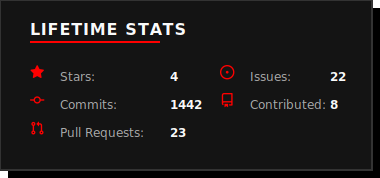
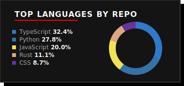
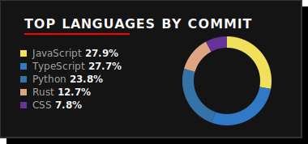
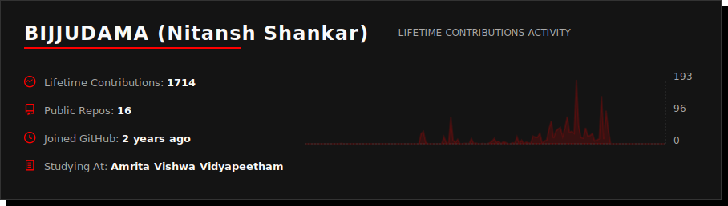

# Hi, I'm Nitansh Shankar

### Full-Stack Developer | AI/ML Enthusiast

 

  
  
 

---

### About Me

  

 

### Tech Stack & Tools

  

 

### GitHub Stats & Favourite Projects

  <!--STATS_START-->

   
  <table border="0" cellpadding="0" cellspacing="0" style="border-collapse: collapse; border: none;">
    <tr>
      <td align="center" style="border: none;"></td>
      <td align="center" style="border: none;"></td>
    </tr>
    <tr>
      <td align="center" style="border: none;"></td>
      <td align="center" style="border: none;" valign="middle">
        

          
           
          
           
          
        

      </td>
    </tr>
  </table>
   
  

<!--STATS_END-->

 

### Contribution Graph

  <picture>
    <source media="(prefers-color-scheme: dark)" srcset="https://raw.githubusercontent.com/BIJJUDAMA/BIJJUDAMA/output/github-contribution-grid-snake-dark.svg">
    <source media="(prefers-color-scheme: light)" srcset="https://raw.githubusercontent.com/BIJJUDAMA/BIJJUDAMA/output/github-contribution-grid-snake.svg">
    
  </picture>

 

   
  

  
  <h2><i>"Code is poetry."</i></h2>
  

  
   
  
  

