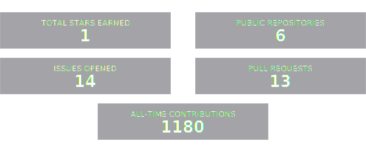
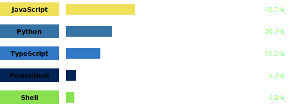

# Hi, I'm Nitansh Shankar

### Full-Stack Developer | AI/ML Enthusiast

 

  
  
 

---

### About Me

  

 

### Tech Stack & Tools

  

 

### GitHub Stats

  <!--STATS_START-->

   
  

    
  <h3 style="color: #bb9af7; margin-bottom: 5px;">Top Languages</h3>

  
   

  <!--STATS_END-->

 

### Contribution Graph

  <picture>
    <source media="(prefers-color-scheme: dark)" srcset="https://raw.githubusercontent.com/BIJJUDAMA/BIJJUDAMA/output/github-contribution-grid-snake-dark.svg">
    <source media="(prefers-color-scheme: light)" srcset="https://raw.githubusercontent.com/BIJJUDAMA/BIJJUDAMA/output/github-contribution-grid-snake.svg">
    
  </picture>

 

   
  
  ═══════════════════════════════════════════════════════
  
  <h2><i>"Code is poetry."</i></h2>
  
  ═══════════════════════════════════════════════════════
  
   
  
  

